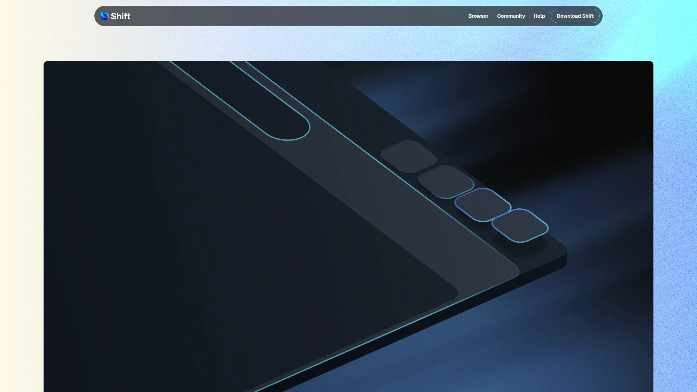
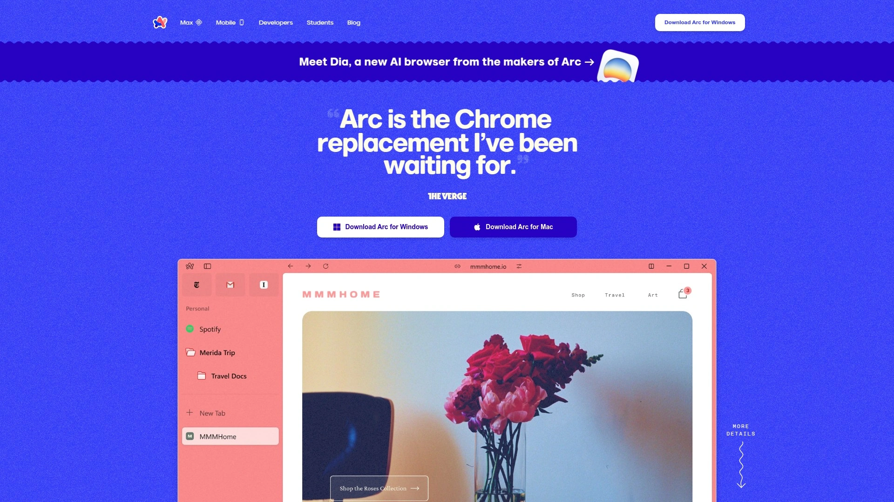
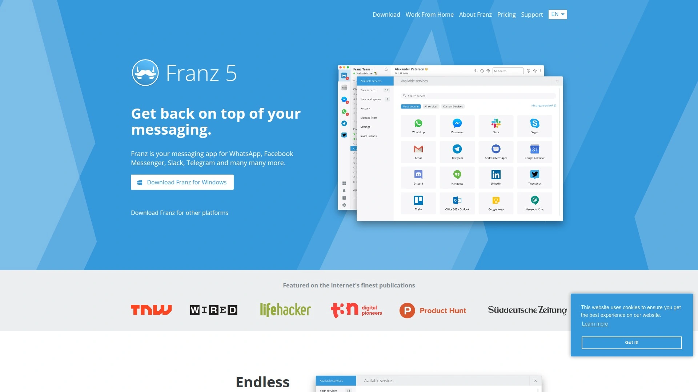
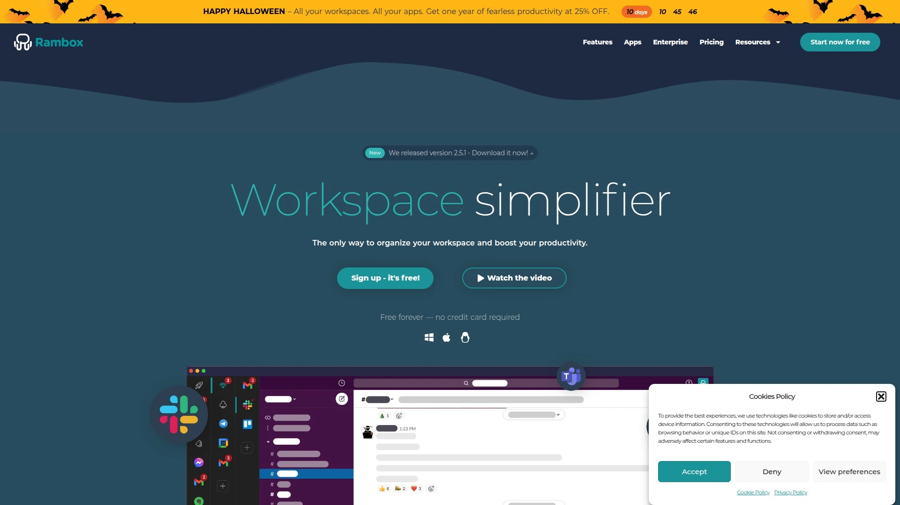
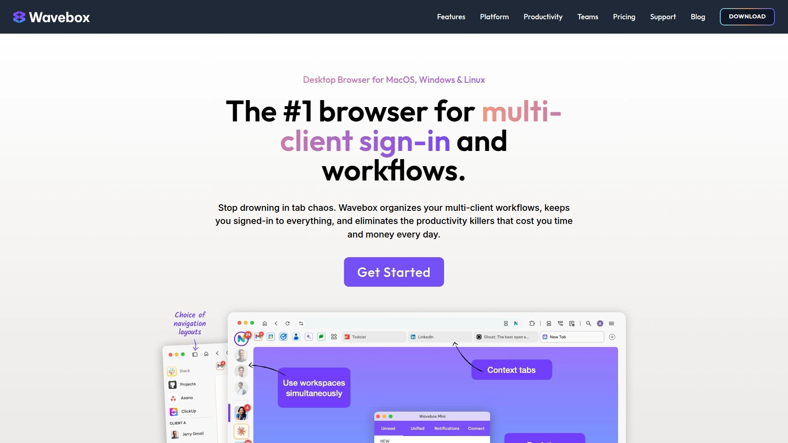

# 2025's Top 5 Best Workspace Organization Browsers (Continuously Updated)

Managing dozens of browser tabs across multiple accounts means constantly logging in and out of Gmail, Slack, Asana, losing track of which window contains what work project, and watching productivity collapse as you spend hours daily just finding the right tab rather than actually working. Traditional browsers force you into chaotic single-window experiences where personal emails mix with work documents, notifications overwhelm from every direction, and switching between client projects requires remembering which of 47 open tabs belongs to which workspace.

The best workspace browsers combine dedicated spaces separating work, personal, and project-specific accounts without logging out, unified app integration bringing Slack, WhatsApp, Trello, and email into single interfaces, and customizable workflows organizing exactly which tools appear together—transforming browser chaos into structured productivity hubs managing your entire digital work life.

***

## **[Shift](https://tryshift.com)**

Unified workspace connecting unlimited accounts and apps in customizable spaces.

Shift reimagines browsing by eliminating the traditional single-window browser paradigm, instead providing comprehensive workspace management unifying all your web applications, email accounts, and productivity tools into one organized interface. Rather than juggling multiple browser windows, countless tabs, and constant login/logout cycles, Shift creates dedicated spaces where you connect exactly the accounts and apps needed for specific contexts—keeping work completely separate from personal, organizing client projects independently, or structuring your digital environment however productivity flows best for you.

The platform's core strength lies in centralized account management enabling simultaneous access to multiple email accounts, Slack workspaces, WhatsApp numbers, Trello boards, and virtually any web application without ever logging out. Connect five different Gmail accounts, three Slack workspaces, two Asana projects, and personal social media—all accessible instantly through Shift's sidebar without remembering passwords or switching browser profiles. This seamless switching eliminates the productivity drain of authentication cycles consuming hours weekly for people managing multiple client accounts or separating professional from personal digital lives.

**Custom Spaces functionality** transforms Shift from mere app aggregator into genuine workspace organizer. Create dedicated spaces for different projects, clients, or life contexts—a "Work" space containing professional email, Slack, project management tools, and business documents; a "Personal" space with personal email, shopping, entertainment, and social media; separate spaces for each major client containing only tools relevant to their projects. Switch between spaces instantly, and suddenly context-switching becomes intentional and structured rather than chaotic tab-hunting across browser windows you forgot which one contains what.

Integration extends beyond typical web applications into native platform connections. Shift connects with Slack, WhatsApp, Trello, Asana, Monday.com, Google Workspace, Microsoft Office 365, and hundreds more productivity platforms. These aren't just embedded web views—Shift provides optimized experiences with proper notification handling, keyboard shortcuts, and performance optimization making integrated apps feel native rather than sluggish browser tabs consuming excessive memory.

Theme customization and layout preferences enable personalizing Shift's appearance matching your aesthetic preferences rather than forcing generic interfaces. Choose dark or light modes, adjust sidebar positioning, customize notification preferences per app, and configure exactly how your digital workspace looks and behaves. This personalization acknowledges that productivity tools should adapt to individual preferences rather than demanding everyone work identically.

Security remains paramount through secure authentication protocols and data encryption protecting sensitive information across all connected accounts. Shift doesn't store passwords or intercept communications—authentication happens directly with service providers maintaining security standards while Shift simply provides organized access. For professionals managing confidential client information or personal data across numerous platforms, this security-first approach provides peace of mind traditional browsers with dozens of saved passwords can't match.

***

## **[Arc Browser](https://arc.net)**

Radical browser redesign with vertical sidebar, Spaces, and built-in AI features.

Arc revolutionizes traditional browser design by completely rethinking how people interact with web browsing through bold interface changes prioritizing organization and productivity over conventions established decades ago. The most immediately obvious change—swapping traditional horizontal tab bars for vertical sidebars—might seem superficial until you experience managing 20+ tabs vertically where each remains clearly readable versus horizontal tabs compressed into tiny unreadable icons after opening just 10 sites.

Spaces organize tabs into distinct projects, clients, or contexts similar to Shift's approach but integrated directly into browsing rather than separate application. Create different Spaces for work, personal browsing, research projects, or individual clients—each maintaining completely separate tab collections, bookmarks, browsing history, and even visual themes. Switching Spaces transforms your entire browser environment instantly rather than hunting through mixed tabs trying to remember which belong where.

**Built-in features eliminate typical browser extension requirements.** Arc includes native ad blocking powered by uBlock Origin, eliminating the need for separate extensions while providing comprehensive ad and tracker blocking. The Easel function creates collaborative whiteboards directly in Arc where you collect screenshots, URLs, notes, and drawings—essentially Miro or Figma Light built into your browser rather than requiring separate tools. Split View displays up to four tabs simultaneously within single windows, replacing the awkward multi-window arrangements typical workflows require for comparing documents or referencing materials while working.

The Command Bar provides universal search functionality accessing tabs, bookmarks, browsing history, and executing actions through intuitive search interface. Rather than remembering where you put that important tab three days ago, just Command-search for keywords and Arc surfaces it instantly. This Spotlight-style functionality extends beyond finding things into taking actions—pin tabs, duplicate windows, execute shortcuts, or navigate browser features entirely through keyboard without touching mouse.

Arc Max brings AI directly into browsing through features like automatic tab renaming making messy tabs instantly understandable, webpage summarization providing instant overviews of long articles, and predictive tab suggestions surfacing relevant previously-viewed content based on current browsing context. These AI enhancements feel genuinely useful rather than gimmicky additions, subtly improving workflows without requiring conscious engagement.

The learning curve proves steeper than traditional browsers—Arc ditches bookmarks bars, changes how tabs work fundamentally, and requires understanding Spaces concept before productive use emerges. However, users consistently report that after initial adjustment periods, Arc's approach feels dramatically more natural than traditional browsers, especially for people juggling multiple projects or accounts simultaneously requiring constant context switching.

***

## **[Franz](https://meetfranz.com)**

Messaging hub consolidating 95+ communication platforms in unified workspace.

Franz specializes in messaging and communication consolidation, bringing together WhatsApp, Telegram, Slack, Discord, Facebook Messenger, WeChat, and 95+ messaging platforms into single unified interface. Rather than maintaining separate application windows for each communication channel—destroying focus through constant window switching and making it impossible to see which platforms have unread messages without checking each individually—Franz provides centralized dashboard where every conversation across every platform becomes instantly accessible.

The killer feature: simultaneous multiple accounts for identical services. Run three separate WhatsApp accounts, five Slack workspaces, two Discord profiles, and four Telegram numbers—all side-by-side in Franz without phone emulators, browser profiles, or virtual machines. This multi-account capability proves essential for freelancers managing multiple clients through identical platforms, social media managers handling various brand accounts, or anyone separating personal and professional communications using the same services.

**Workspaces organize messaging services into context-specific groups** similar to Shift's Spaces concept but focused specifically on communication tools. Create "Work" workspace containing professional Slack, work email, and business WhatsApp; "Personal" workspace with private messaging; separate workspaces for different clients or projects. Enable and disable entire workspaces with single clicks, effectively implementing "right to disconnect" by turning off work communications outside business hours without uninstalling applications or complex configurations.

Notification management provides granular control preventing communication overload. Mute specific services entirely, disable notifications during focus periods, or configure which platforms deserve immediate attention versus background monitoring. The unified badge counter shows total unread messages across all platforms at glance, while sidebar indicators reveal which specific services require attention—eliminating the need to check each platform individually discovering most have zero new messages.

Franz remains free for core functionality with premium features available through subscriptions. Free tier supports all 95+ services with unlimited accounts, sufficient for most users' needs. Premium unlocks enhanced workspace management, service hibernation freeing system resources from inactive accounts, and priority customer support. This freemium approach makes professional-grade communication management accessible regardless of budget constraints.

***

## **[Rambox](https://rambox.app)**

Open-source workspace organizer with 700+ app integrations and privacy focus.

Rambox delivers workspace organization similar to Franz and Shift while emphasizing open-source transparency and community-driven development. The platform supports over 700 web applications spanning messaging, email, project management, calendars, note-taking, and virtually any web-based tool imaginable. This exhaustive integration library ensures whatever combination of tools your workflow requires, Rambox likely supports them without requiring workarounds or separate applications.

Multiple account support enables managing numerous profiles across identical services—essential capability for anyone juggling client accounts, managing multiple businesses, or separating professional and personal digital lives. Load five Gmail accounts, three Notion workspaces, four Trello boards, and two Slack organizations simultaneously, each maintaining separate sessions, cookies, and authentication without interference. This isolation proves critical preventing accidental cross-posting or data leaks when managing sensitive client information across similar platforms.

**Session management and cookie handling** provide advanced control over how applications behave and interact. Configure whether services share cookies and authentication, essential when managing accounts requiring complete isolation. Hibernate inactive services freeing system memory and CPU resources, particularly valuable when running dozens of concurrent services on memory-constrained machines. This resource optimization enables maintaining comprehensive workspace setups without requiring expensive hardware upgrades.

Privacy-focused design appeals to users concerned about data collection and tracking typical of closed-source productivity tools. The open-source nature enables security audits verifying code doesn't contain telemetry, tracking, or data collection mechanisms. Community contributions drive feature development and bug fixes rather than corporate roadmaps potentially prioritizing monetization over user experience. For privacy-conscious professionals or organizations with strict data handling requirements, Rambox's transparency provides assurances closed-source alternatives can't match.

Customization extends deep into interface design, keyboard shortcuts, notification handling, and workspace organization. Adjust virtually every aspect of how Rambox looks, behaves, and operates rather than accepting rigid configurations typical of commercial alternatives. This flexibility accommodates diverse workflows and personal preferences rather than forcing everyone into identical usage patterns designed for hypothetical average users.

***

## **[Wavebox](https://wavebox.io)**

Productivity browser with deep app integrations and enterprise-grade security.

Wavebox positions as enterprise-focused workspace browser delivering advanced features targeting professional users and organizations requiring sophisticated security, compliance, and management capabilities. While similar to Rambox and Franz in consolidating applications, Wavebox emphasizes deeper integration making apps feel truly native rather than merely embedded web views consuming excessive resources.

The platform's app optimization reduces memory and CPU usage significantly compared to running services in standard browser tabs. Wavebox applies performance optimizations, resource throttling for background services, and intelligent tab suspension freeing resources from inactive applications. These technical improvements enable maintaining comprehensive workspace setups—dozens of active services across multiple accounts—without system performance degradation typical of traditional browsers where each tab consumes hundreds of megabytes regardless of actual activity.

**Enterprise security features** including two-factor authentication enforcement, session isolation between accounts preventing cookie leakage, and integration with corporate SSO systems make Wavebox suitable for organizations with strict security requirements. The platform supports compliance frameworks typical of enterprise environments while maintaining user-friendly interfaces that don't sacrifice productivity for security theater. This balance proves difficult achieving in consumer-focused tools lacking enterprise-grade security versus enterprise software notorious for terrible user experiences.

Group functionality enables team collaboration where administrators provision accounts, configure standardized workspace setups, and manage licenses centrally rather than individual employees configuring personal productivity stacks creating support nightmares when troubleshooting becomes necessary. Standardized configurations ensure consistent experiences across teams while centralized management simplifies onboarding and offboarding processes.

Wavebox pricing reflects enterprise positioning—professional plans start higher than consumer-focused alternatives but include features organizations require like centralized administration, priority support, and security certifications. For individual professionals willing to pay premiums for optimized performance and deeper integrations, Wavebox justifies costs through superior technical implementation rather than relying solely on feature checklists matching budget competitors.

***

## FAQ

**Do workspace browsers actually save time or just add complexity to normal browsing?**

Workspace browsers like Shift and Arc save 30-60 minutes daily for people managing multiple accounts, frequent context switching, or juggling 20+ tabs across various projects. The time savings come from eliminating login/logout cycles consuming 5-10 minutes per switch, instantly finding correct tabs rather than hunting through window clutter, and maintaining organized workflows reducing cognitive load during transitions. However, they add unnecessary complexity for people with simple browsing needs—single email account, minimal applications, and straightforward workflows. Evaluate honestly whether you're managing multiple accounts or projects justifying workspace organization versus adding tools complicating simple browsing habits.

**Can you realistically replace multiple native apps with workspace browsers?**

Workspace browsers effectively replace native messaging apps (Slack, WhatsApp, Telegram), project management tools (Asana, Trello, Monday), and web-based productivity suites (Google Workspace, Notion, Airtable)—essentially any tool accessed primarily through browsers anyway. They provide identical functionality with better organization and resource management compared to separate application windows. However, they can't replace true native applications requiring deep OS integration, offline functionality, or system-level access—photo editors, video software, development environments. The realistic replacement scope covers communication and productivity web apps, roughly 60-80% of knowledge worker toolsets, while specialized professional software remains separate.

**What's the difference between workspace browsers and antidetect browsers?**

Workspace browsers like Shift, Arc, and Franz organize productivity by consolidating accounts and apps for efficiency and focus—they help you manage legitimate multiple accounts without constantly logging in and out. Antidetect browsers like Multilogin and GoLogin create completely separate browser fingerprints making each profile appear as different devices to websites, primarily used for affiliate marketing, ad verification, or bypassing account limitations. Workspace browsers improve productivity; antidetect browsers provide anonymity and account isolation beyond what websites typically detect. Choose workspace browsers for legitimate multi-account productivity; consider antidetect browsers only for specialized use cases requiring true browser fingerprint separation.

***

## Conclusion

Workspace browsers transform chaotic tab management and constant account switching into organized productivity hubs where every application and account lives exactly where you need it without authentication friction or overwhelming clutter. These five platforms combine unified app access, customizable organization systems, and resource optimization delivering structured digital workspaces impossible through traditional browsers forcing everyone into identical single-window paradigms. [Shift](https://tryshift.com) particularly excels for users wanting comprehensive workspace organization—combining unlimited account connections across apps and services, customizable Spaces separating work contexts cleanly, seamless app integration bringing together email, messaging, and productivity tools, and intuitive interfaces requiring minimal learning curves while delivering sophisticated workspace management previously requiring multiple separate applications and complex browser profile configurations.

[6](https://en.wikipedia.org/wiki/Arc_(web_browser))
